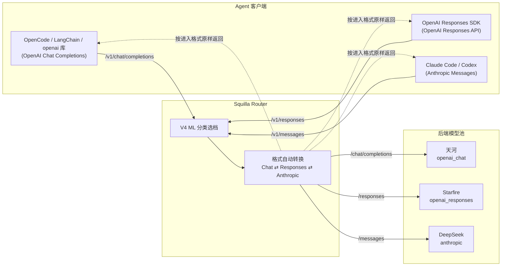

# Squilla API Router

一个 HTTP 服务：精准 SquillaRouter ML 分类 + 模型分级路由 + 后端 LLM 调用。

## 架构

```text
你的智能体（OpenAI Chat / Anthropic Messages 格式）
        ↓ http://127.0.0.1:8002
Squilla API Router（一个进程：ML 分类 → 策略门控 → 选模型 → 调用）
        ↓
模型池
  c0 → GLM-5.3-Flash（便宜快速）
  c1 → DeepSeek-V4（默认均衡）
  c2 → Qwen3.8-27B（中等偏强）
  c3 → Qwen3.5-397B-A17B（最强）
```

使用和 OpenSquilla 相同的 V4 Phase 3 ML 分类器（BGE + LightGBM + MLP），
相同 4 阶段策略管道。中文友好。

## 支持的 API 格式

| 端点 | 格式 | 适用框架 |
|------|------|---------|
| `POST /v1/chat/completions` | OpenAI Chat Completions | LangChain、OpenCode、openai 库 |
| `POST /v1/responses` | OpenAI Responses API | OpenAI Responses SDK |
| `POST /v1/messages` | Anthropic Messages | Codex、Claude Code、Anthropic SDK |

三种格式均支持流式（SSE）。**客户端（Agent）用什么格式进来，收到的就是什么格式返回**；后端按它声明的原生 API 格式自动转换，用户无需关心 Agent 能否直接接入后端服务。

Router 的完整链路：鉴权 → 图片/视频检测 → V4 分类选模型 → 替换 `model` 字段 → 按后端原生格式自动转换并转发 → 按进入格式原样转回。

### 请求流示意图



等效 ASCII 图：

```text
┌──────────────────────┐
│  OpenCode / LangChain│──┐  OpenAI Chat
│  openai 库           │  │
└──────────────────────┘  │
┌──────────────────────┐  │   ┌────────────────────────────────────┐
│  Responses SDK       │  ├──►│ 鉴权 → ML 分类 → 格式自动转换      │
│  (OpenAI Responses)  │──┤   │ (Chat ⇄ Responses ⇄ Anthropic)    │
└──────────────────────┘  │   └────────────────────────────────────┘
┌──────────────────────┐  │        │                    │               │
│  Claude Code / Codex │──┘        ▼                    ▼               ▼
│  (Anthropic Messages)│   ┌─────────────┐   ┌────────────────┐  ┌────────────┐
└──────────────────────┘   │ 天河        │   │ Starfire       │  │ DeepSeek   │
                           │ openai_chat │   │ openai_responses│  │ anthropic  │
        ◄──  响应按进入格式原样转回  ──┴─────────────┘   └────────────────┘  └────────────┘
```

### 自动转换示例

例如 Agent 以 **OpenAI Chat Completions** 接入（`/v1/chat/completions`），而本次路由到的后端只支持 **Anthropic Messages**（如 DeepSeek `/messages`）：

```text
 Agent                        Squilla Router                     后端（DeepSeek）
  │   OpenAI Chat 请求          │                                    │
  ├────────────────────────────►│  ML 分类选 R3                       │
  │                             │  请求转成 Anthropic Messages ─────►│  /messages
  │                             │                                    │
  │                             │  ◄─────────────────────────────────┤  Anthropic 响应
  │   OpenAI Chat 响应           │  响应转回 OpenAI Chat               │
  ◄────────────────────────────┤                                    │
```

流式同样自动转换（SSE 进、SSE 出）：例如 Agent 用 Chat 流接入、后端返回 Anthropic 流，Router 会把 Anthropic 的 `message_start / content_block_delta / message_stop` 实时转成 Chat 的 `chat.completion.chunk` 流。

转换由内置的 llm-rosetta 双向桥接完成：OpenAI Chat ⇄ Responses ⇄ Anthropic 全 6 方向自动转换（请求、响应、流式），无需额外网关或 SDK 适配。每个 Provider 在 `.env` 里用 `XXX_FORMAT` 声明其原生格式（`openai_chat` / `openai_responses` / `anthropic`），未声明默认 `openai_chat`。

## 快速启动

```powershell
# 1. 复制环境变量模板，填入后端地址和 key
Copy-Item .env.example .env
# 编辑 .env

# 2. 安装依赖
pip install -r requirements.txt

# 3. 启动
uvicorn app:app --host 127.0.0.1 --port 8002
```

## 智能体接入

### Codex / Claude Code（Anthropic Messages 格式）

在 `settings.json` 中配置：

```json
{
  "env": {
    "ANTHROPIC_BASE_URL": "http://127.0.0.1:8002",
    "ANTHROPIC_API_KEY": "anything"
  }
}
```

### LangChain / OpenCode / openai 库（OpenAI Chat 格式）

```python
from openai import OpenAI

client = OpenAI(
    base_url="http://127.0.0.1:8002/v1",
    api_key="anything",
)
response = client.chat.completions.create(
    model="router",
    messages=messages,
)
```

## 降级 / 回退（Failover）

当选中的档位在后端调用失败时，Router 自动降级到下一个可用档位，客户端无感知。

- **触发条件**：连接失败、超时、HTTP 429/5xx/4xx、或响应无有效内容
- **降级顺序**：选中的档位 → 其余档位按 c0/c1/c2/c3 顺序尝试
- **图片请求**：只在支持图片的档位（c0/c1/c3）内降级
- **全部失败**：返回最后一个错误 + `_router.attempts` 列出所有尝试

响应 `_router` 新增字段：

```json
{
  "_router": {
    "tier": "c1",
    "model": "GLM-5.3-Flash",
    "attempts": ["R0", "c0", "c1"],
    "fallback_used": true
  }
}
```

`attempts` 记录完整尝试链路，`fallback_used` 标记是否发生了降级。

## 鉴权

Router 会校验 `Authorization: Bearer <ROUTER_API_KEY>`。`.env` 里的 `ROUTER_API_KEY` 是自己定义的本地密钥，和后端平台的 key 无关。

```text
# 在 .env 里设置
ROUTER_API_KEY=router-local-key-001
```

- 无 key / 错误 key → 401
- `GET /health` 和 `GET /router-status` 不需要鉴权

OpenCode / 智能体接入时：

```json
{
  "provider": {
    "router": {
      "npm": "@ai-sdk/openai-compatible",
      "options": {
        "baseURL": "http://127.0.0.1:8002/v1",
        "apiKey": "router-local-key-001"
      }
    }
  }
}
```

如果不想启用鉴权，把 `ROUTER_API_KEY` 留空即可。

## 模型配置

支持多 provider：base_url 和 api_key 集中定义一次，每个档位只引用 provider 名 + 模型。

```text
# Provider 表：端点 + key 只在此定义
BACKEND_BASE_URL=https://chat.tianhe-tech.com/v1
BACKEND_API_KEY=your-key

# 每个 tier：只填模型 + 能力标志
C0_MODEL=Qwen3.8-27B
C0_SUPPORTS_IMAGE=1
C0_SUPPORTS_VIDEO=1

C1_MODEL=GLM-5.3-Flash
C1_SUPPORTS_IMAGE=1
C1_SUPPORTS_VIDEO=1

C2_MODEL=DeepSeek-V4
C2_SUPPORTS_IMAGE=0
C2_SUPPORTS_VIDEO=0

C3_MODEL=Qwen3.5-397B-A17B
C3_SUPPORTS_IMAGE=1
C3_SUPPORTS_VIDEO=1
```

### 配置多个 Provider

`.env` 里每个 provider 用前缀定义端点，然后在代码的 `PROVIDERS` 表里注册并让 tier 引用。例如加一个 DeepSeek provider：

```text
# .env
DEEPSEEK_BASE_URL=https://api.deepseek.com/v1
DEEPSEEK_API_KEY=your-deepseek-key
```

```python
# app.py PROVIDERS 表
PROVIDERS = {
    "tianhe": {...},
    "deepseek": {
        "base_url": os.environ.get("DEEPSEEK_BASE_URL", ""),
        "api_key": os.environ.get("DEEPSEEK_API_KEY", ""),
    },
}
```

然后任意档位（如 c2）可以指向 deepseek：

```text
C2_MODEL=deepseek-chat
# C2_PROVIDER=deepseek   ← 可选，代码里 tier 默认 provider 是 tianhe
# 如需切换，在 app.py 的 TIERS 里把该档的 provider 改为 "deepseek"
```

## 多模态图片/视频路由

当请求包含图片或视频时，Router 会**先按配置筛选支持图片/视频的档位**，
再按文本 tier 方式（V4 ML 分类提示词）在可用档位内路由。

支持 OpenAI `image_url` 和 Anthropic `image`/`video` 格式。

### 配置

每个档位在 `.env` 里用 `SUPPORTS_IMAGE` / `SUPPORTS_VIDEO` 标注多模态能力：

VISION_MODEL=GLM-5.3-Flash
VISION_API_KEY=sk-your-key
VISION_BASE_URL=https://chat.tianhe-tech.com/v1

# c0: 支持图片
C0_MODEL=Qwen3.8-27B
C0_SUPPORTS_IMAGE=1
C0_SUPPORTS_VIDEO=1

# c2: 纯文本，不支持图片（图片请求会排除它）
C2_MODEL=DeepSeek-V4
C2_SUPPORTS_IMAGE=0
C2_SUPPORTS_VIDEO=0

# c3: 支持图片
C3_MODEL=Qwen3.5-397B-A17B
C3_SUPPORTS_IMAGE=1
C3_SUPPORTS_VIDEO=1
```

### 路由逻辑

```text
请求包含图片/视频
  → 筛选 SUPPORTS_IMAGE=1 的档位（如 c0/c1/c3）
  → 用 V4 ML 分类器跑提示词文本
  → R0→c0, R1→c1, R2/R3→c3（只在多模态档位内）
纯文本请求
  → 正常走 R0-R3 → c0-c3 全档位
```

### 实测

| 图片请求提示词 | 路由 tier | 模型 |
|---------------|----------|------|
| "这是什么"（简单） | c0 | Qwen3.8-27B |
| "分析架构+部署代码"（复杂） | c3 | Qwen3.5-397B-A17B |

### 响应标注

```json
{
  "_router": {
    "tier": "c0",
    "model": "Qwen3.8-27B",
    "vision": true,
    "video": false,
    "source": "vision_route"
  }
}
```

## 实测结果

| 请求类型 | 分类结果 | 路由到的模型 | 置信度 |
|---------|---------|------------|--------|
| "你好，介绍自己" | R0 | GLM-5.3-Flash | 0.94 |
| "分析并发问题，设计架构" | R3 | Qwen3.5-397B-A17B | 0.95 |

## 响应格式

标准 OpenAI 格式，额外附加 `_router` 元数据：

```json
{
  "id": "chatcmpl-xxx",
  "object": "chat.completion",
  "choices": [...],
  "usage": {...},
  "_router": {
    "tier": "R0",
    "model": "GLM-5.3-Flash",
    "raw_route_class": "R0",
    "confidence": 0.94,
    "thinking_mode": "T0",
    "material_tokens": 3,
    "probabilities": {"R0": 0.94, "R1": 0.05, "R2": 0.01, "R3": 0.00}
  }
}
```

Anthropic 格式响应：

```json
{
  "id": "msg_router",
  "type": "message",
  "role": "assistant",
  "content": [{"type": "text", "text": "..."}],
  "model": "GLM-5.3-Flash",
  "stop_reason": "end_turn",
  "usage": {"input_tokens": 18, "output_tokens": 229},
  "_router": {...}
}
```

## 管理端点

| 端点 | 说明 |
|------|------|
| `GET /health` | 健康检查 + ML 分类器状态 |
| `GET /router-status` | 各档位配置 + 路由映射表 |

## 语义分类原理

每轮请求前，Router 用本地小模型精准判断请求难度：

1. **特征提取**：BGE 嵌入（1536 维）+ TF-IDF（102 维）+ 上下文/历史特征（390 维总特征）
2. **分类**：LightGBM 主分类器 + 辅助头 + MLP，融合概率 → R0/R1/R2/R3
3. **策略门控**：
   - confidence_gate：低置信度降级到默认档
   - complaint_upgrade：投诉/催促内容升档
   - anti_downgrade：保护 KV-cache 连续性
   - large_context_floor：大上下文强制升档
4. **模型绑定**：R0→c0、R1→c1、R2→c2、R3→c3

## 项目结构

```text
squilla_api_router/
├── README.md               # 本文件
├── .env / .env.example     # 模型配置
├── requirements.txt        # 依赖
├── app.py                  # 主服务：接收 → 分类 → 选模型 → 调用
├── contracts.py            # 请求校验
├── limits.py               # 请求限制
├── conversation_context.py # 上下文提取
├── final_policy.py         # 4 阶段策略管道
├── model_bundle/           # V4 Phase 3 ML 模型资产（约 70MB）
│   ├── bge_onnx/           # BGE 嵌入模型
│   ├── features/           # TF-IDF / SVD / PCA
│   ├── lgbm_main.bin       # LightGBM 主分类器
│   ├── lgbm_aux.bin        # 辅助头
│   └── mlp/                # MLP 头
└── v4_runtime/             # 分类推理逻辑
    ├── inference/          # InferenceCore、融合、后处理
    └── features.py         # 特征工程
```

## 依赖版本

```text
numpy >= 1.26
lightgbm == 4.5.x（必须，其他版本可能无法加载模型）
scikit-learn >= 1.8
onnxruntime >= 1.17
tokenizers >= 0.15
joblib >= 1.3
pyyaml >= 6.0
fastapi >= 0.110
uvicorn >= 0.30
httpx >= 0.27
python-dotenv >= 1.0
```

## 许可

- 本项目代码：Apache 2.0
- BGE 模型：MIT（BAAI/bge-small-zh-v1.5）
- SquillaRouter 分类器来源：OpenSquilla（Apache 2.0），经由 Crush12999/squilla-router-server 抽取
